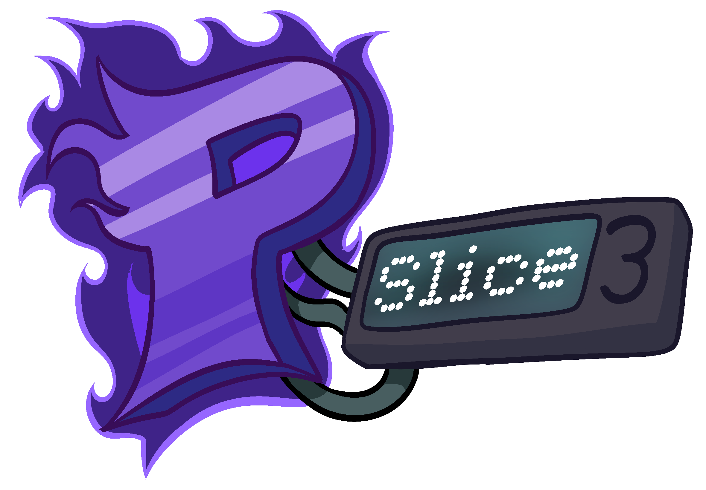

<!-- Thanks soushimiya for this README template! -->
<!-- Improved compatibility of back to top link: See: https://github.com/othneildrew/Best-README-Template/pull/73 -->
<a id="readme-top"></a>
<!--
*** Thanks for checking out the Best-README-Template. If you have a suggestion
*** that would make this better, please fork the repo and create a pull request
*** or simply open an issue with the tag "enhancement".
*** Don't forget to give the project a star!
*** Thanks again! Now go create something AMAZING! :D
-->


<!-- PROJECT SHIELDS -->
[![Contributors][contributors-shield]][contributors-url]
[![Forks][forks-shield]][forks-url]
[![Stargazers][stars-shield]][stars-url]
[![Issues][issues-shield]][issues-url]
[![MIT License][license-shield]][license-url]


<!-- PROJECT LOGO -->
<br />
<div align="center">
  <a href="https://github.com/Psych-Slice/P-Slice">
    
  </a>

<h3 align="center">P-Slice Engine</h3>

  <p align="center">
    Crossover between Psych Engine and newer versions of FNF (also known as V-Slice)
    <br />
    <a href="https://github.com/Psych-Slice/P-Slice/wiki"><strong>Explore the Wiki »</strong></a>
    <br />
    <br />
    ·
    <a href="https://github.com/Psych-Slice/P-Slice/issues">Report Bug or Request Feature</a>
    ·
    <a href="https://github.com/Psych-Slice/P-Slice/pulls">Create Pull Request</a>
  </p>
</div>

#### Made With


<!-- ABOUT THE PROJECT -->
## About

P-Slice engine is a crossover between Psych Engine and the newest version of Friday Night Funkin.

It's meant to bring new visuals and features from newer versions of FNF and make changes to the existing ones to make them feel closer to the ones in the V-Slice.

<p align="right">(<a href="#readme-top">back to top</a>)</p>

## Features
| V-Slice's freeplay menu | Results screen|
|-|-|
| | |
|Character selector|Pausable cutscenes|
|||
|Pico|Player editor|
|||
<!-- GETTING STARTED -->
## Getting Started

Pre-built engine can be downloaded from [GameBanana](https://gamebanana.com/mods/535203).
Also, Nightly/Beta builds can be downloaded from [Github Actions](https://github.com/Psych-Slice/P-Slice/actions/workflows/main.yml). (You need to make a Github account.)


If you wanna compile this engine, Please check out <a href="#build">here!</a>

<a id="build"></a>
## Building
### Dependencies
* git
* (Windows-only) Microsoft Visual Studio Community
* (Linux-only) VLC
* Haxe (4.3.6 or greater)


(If you are using windows)
After installing git, it is RECOMMENDED that you open up a command prompt window and type the following
  ```sh
  curl -# -O https://download.visualstudio.microsoft.com/download/pr/3105fcfe-e771-41d6-9a1c-fc971e7d03a7/8eb13958dc429a6e6f7e0d6704d43a55f18d02a253608351b6bf6723ffdaf24e/vs_Community.exe
vs_Community.exe --add Microsoft.VisualStudio.Component.VC.Tools.x86.x64 --add Microsoft.VisualStudio.Component.Windows10SDK.19041 -p
  ```

head into the setup folder located in the root directory of this repository, and execute the setup script:
- ```Windows.bat```  for Windows.
- ```Unix.sh``` for Mac/Linux.


Run
   ```sh
   lime test <platform>
   ```
   where ```<platform>``` gets replaced with windows, linux, or mac (I also like to add ```-final``` flag, but you should be fine without it)

<p align="right">(<a href="#readme-top">back to top</a>)</p>

<!-- CONTRIBUTING -->
## Contributing

### Branches
`master` is the repository's main branch. It contains a PE 1.0 flavor of P-Slice and is the most maintained version.

`master-dev` same as `master`, but it is used for development so it might contain less stable builds.

`pe-0.6.3` works the same way, but built on Psych 0.6.3. Note that it may contain some bugs not present in the master version.

`pe-0.6.3-dev` same as `pe-0.6.3`, but it is used for development so it might contain less stable builds.

<p align="right">(<a href="#readme-top">back to top</a>)</p>


<!-- LICENSE -->
## License

Distributed under the Apache License 2.0. See [Licence](https://github.com/Psych-Slice/blob/P-Slice/master/LICENSE) for more information.

<p align="right">(<a href="#readme-top">back to top</a>)</p>


<!-- MARKDOWN LINKS & IMAGES -->
<!-- https://www.markdownguide.org/basic-syntax/#reference-style-links -->
[contributors-shield]: https://img.shields.io/github/contributors/Psych-Slice/P-Slice.svg?style=for-the-badge
[contributors-url]: https://github.com/Psych-Slice/P-Slice/graphs/contributors
[forks-shield]: https://img.shields.io/github/forks/Psych-Slice/P-Slice.svg?style=for-the-badge
[forks-url]: https://github.com/Psych-Slice/P-Slice/forks
[https://github.com/Psych-Slice/P-Slice/forks]: https://github.com/Psych-Slice/P-Slice/network/members
[stars-shield]: https://img.shields.io/github/stars/Psych-Slice/P-Slice.svg?style=for-the-badge
[stars-url]: https://github.com/Psych-Slice/P-Slice/stargazers
[issues-shield]: https://img.shields.io/github/issues/Psych-Slice/P-Slice.svg?style=for-the-badge
[issues-url]: https://github.com/Psych-Slice/P-Slice/issues
[license-shield]: https://img.shields.io/github/license/Psych-Slice/P-Slice.svg?style=for-the-badge
[license-url]: https://github.com/Psych-Slice/P-Slice/blob/master/LICENSE.txt!
