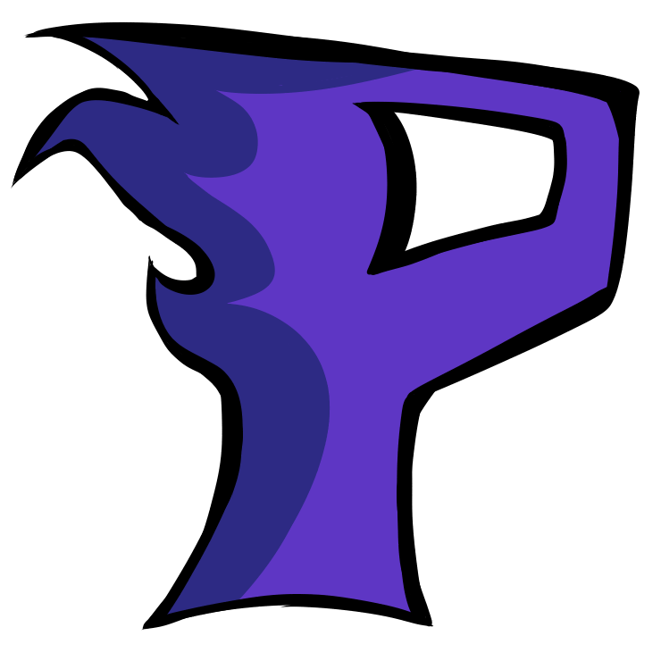
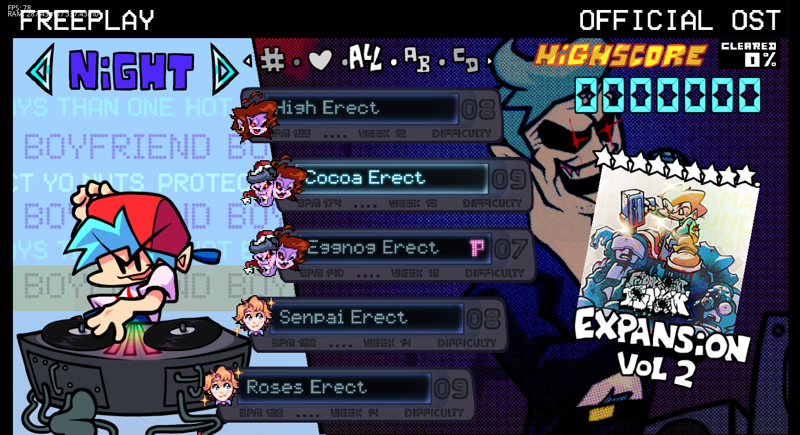
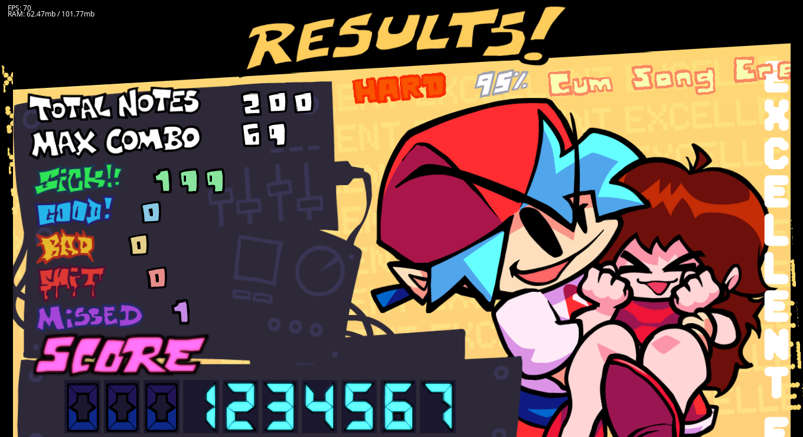
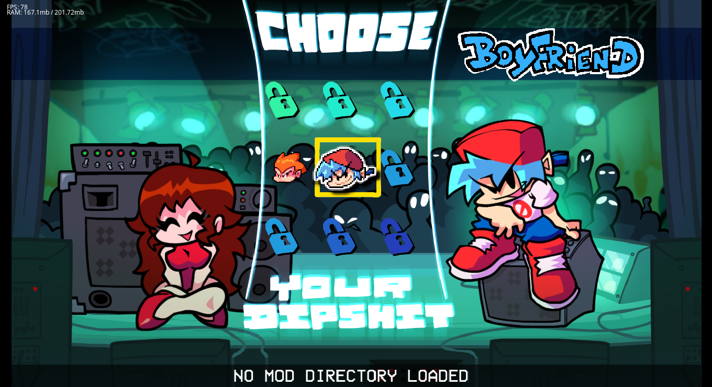
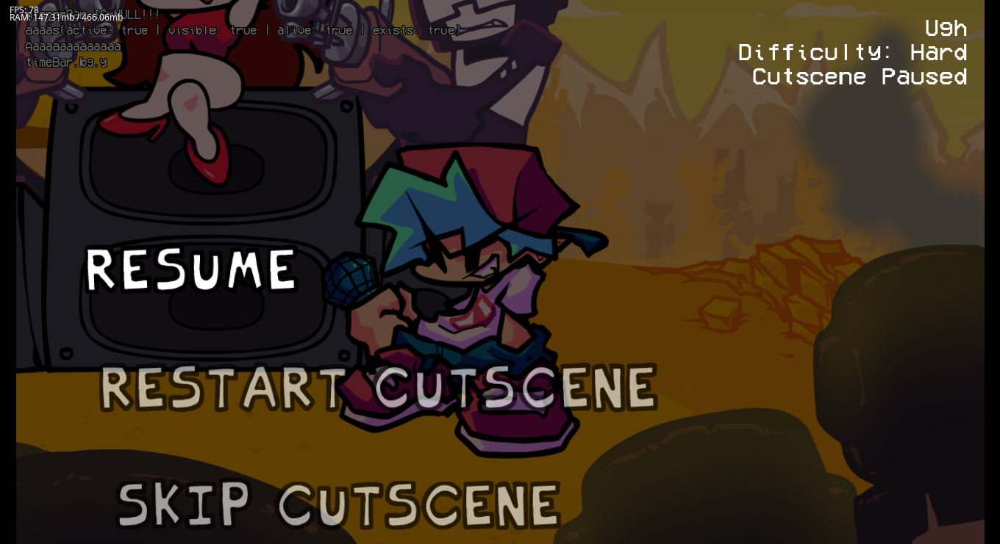
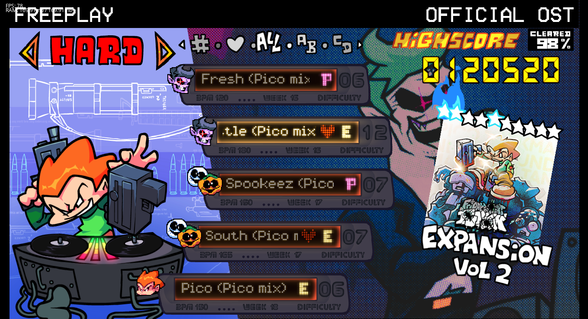

<!-- Thanks soushimiya for this README template! -->
<!-- Improved compatibility of back to top link: See: https://github.com/othneildrew/Best-README-Template/pull/73 -->

<!--
*** Thanks for checking out the Best-README-Template. If you have a suggestion
*** that would make this better, please fork the repo and create a pull request
*** or simply open an issue with the tag "enhancement".
*** Don't forget to give the project a star!
*** Thanks again! Now go create something AMAZING! :D
-->

<!-- PROJECT SHIELDS -->
[![Contributors][contributors-shield]][contributors-url]
[![Forks][forks-shield]][https://github.com/MobilePorting/P-Slice-Mobile/forks]
[![Stargazers][stars-shield]][stars-url]
[![Issues][issues-shield]][issues-url]
[![MIT License][license-shield]][license-url]

<!-- PROJECT LOGO -->
 

  

<h3 align="center">P-Slice Engine Mobile</h3>

  

    Crossover between Psych Engine and newer versions of FNF (also known as V-Slice)
     
    <a href="https://github.com/Psych-Slice/P-Slice/wiki"><strong>Explore the Wiki »</strong></a>
     
     
    ·
    <a href="https://github.com/MobilePorting/P-Slice-Mobile/issues">Report Bug or Request Feature</a>
    ·
    <a href="https://github.com/MobilePorting/P-Slice-Mobile/pulls">Create Pull Request</a>
  

#### Made With

<!-- ABOUT THE PROJECT -->
## About

P-Slice engine is a crossover between Psych engine and the newest Friday Night Funkin.

It's meant to bring new visuals and features from newer versions of FNF and make changes to the existing ones to make them feel closer to the ones in the V-Slice.

(<a href="#readme-top">back to top</a>)

## Features
* V-Slice's freeplay menu (with support for freeplay colors)

* Results screen

* Character selector

* Pausable cutscenes

* Pico

## Modding capabilities 
### custom stickers

Mods made for P-Slice can select which sticker pack and set to use on the next sticker transition.

``setPropertyFromClass("substates.StickerSubState", "STICKER_SET", "sticker-set-1")`` defines which sticker set to use (it's the name of one of the directories in `images/transitionSwag/`)

``setPropertyFromClass("substates.StickerSubState", "STICKER_PACK", "all")`` defines a pack of stickers to use from the current set. If such pack doesn't exist all defined stickers in a ".json" file will be used.

### custom freeplay icons

Freeplay supports 3 types of icons:
- FNF pre 0.3 (using character's head icon)
- FNF 0.3+ (located in `images/freeplay/icons/{charId}pixel.png`)
- FNF 0.5+ (sparrow sprite located in `images/freeplay/icons/{charId}pixel` with .PNG and .XML files)
>  {charId} is the name of the character icon.

### registry folder
Mods can contain a `registry` folder containing entries for P-Slice's registry system (structure is the same as in V-Slice)

They're used to implement custom characters and custom Freeplay styles.

### custom commercials

If your mod is either is global or loaded as the first mod, you can add additional commercials in `videos/commercials` to be used an AttractState

(<a href="#readme-top">back to top</a>)

<!-- GETTING STARTED -->
## Getting Started

Pre-built Engine can be download from [Releases](https://github.com/MobilePorting/P-Slice-Mobile/releases).
Also, Nightly/Beta Build can be download from [Github Actions](https://github.com/MobilePorting/P-Slice-Mobile/actions/workflows/main.yml). (You needs to make a Github account.)

<!-- LICENSE -->
## License

Distributed under the Apache License 2.0. See [Licence](https://github.com/Psych-Slice/blob/P-Slice/master/LICENSE) for more information.

(<a href="#readme-top">back to top</a>)

<!-- MARKDOWN LINKS & IMAGES -->
<!-- https://www.markdownguide.org/basic-syntax/#reference-style-links -->
[contributors-shield]: https://img.shields.io/github/contributors/Psych-Slice/P-Slice.svg?style=for-the-badge
[contributors-url]: https://github.com/MobilePorting/P-Slice-Mobile/graphs/contributors
[forks-shield]: https://img.shields.io/github/forks/MobilePorting/P-Slice-Mobile.svg?style=for-the-badge
[https://github.com/Psych-Slice/P-Slice/forks]: https://github.com/MobilePorting/P-Slice-Mobile/network/members
[stars-shield]: https://img.shields.io/github/stars/MobilePorting/P-Slice-Mobile.svg?style=for-the-badge
[stars-url]: https://github.com/MobilePorting/P-Slice-Mobile/stargazers
[issues-shield]: https://img.shields.io/github/issues/Psych-Slice/P-Slice.svg?style=for-the-badge
[issues-url]: https://github.com/MobilePorting/P-Slice-Mobile/issues
[license-shield]: https://img.shields.io/github/license/MobilePorting/P-Slice-Mobile.svg?style=for-the-badge
[license-url]: https://github.com/MobilePorting/P-Slice-Mobile/blob/master/LICENSE.txt!
